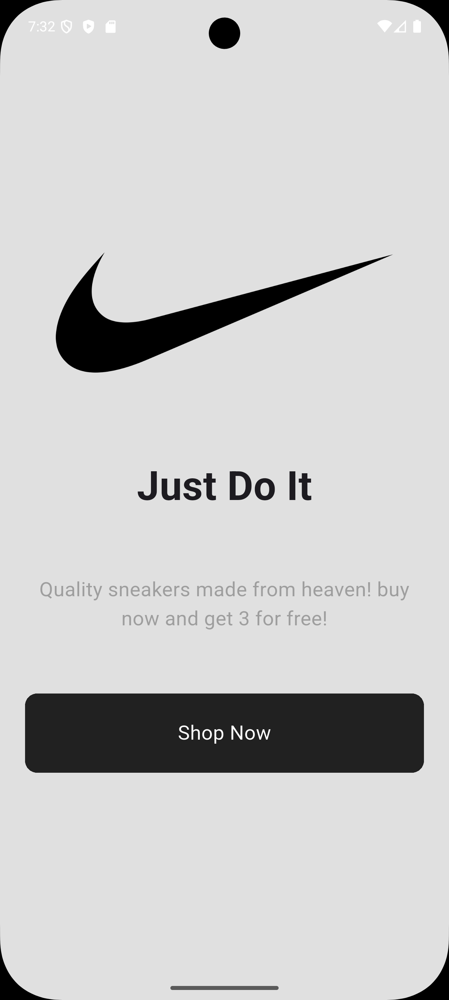
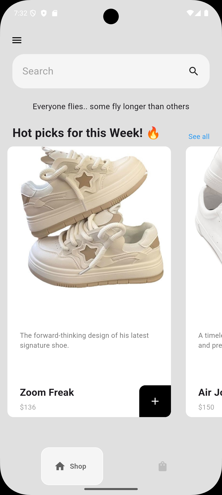
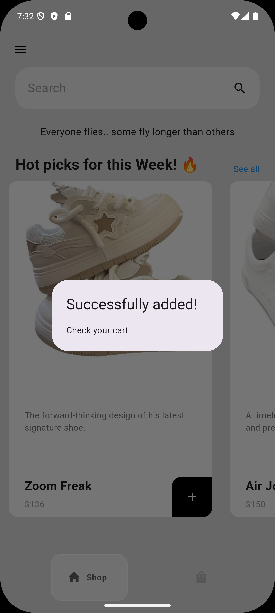
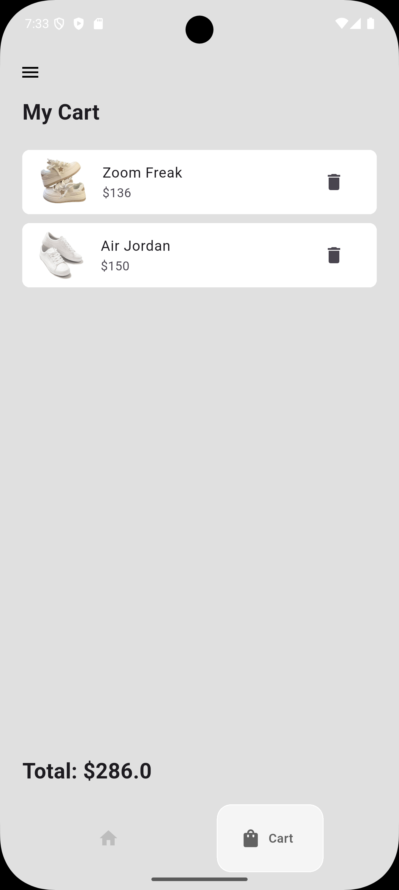

# 👟 Sneaker App

A sleek and modern cross-platform shopping app built with **Flutter**, designed to provide a smooth experience for browsing, selecting, and purchasing the latest sneakers.

---

## 📱 Features

- 🛍️ Browse a catalog of popular sneakers
- 🔍 Search for your favorite brands or styles
- ❤️ Add sneakers to your favorites
- 🛒 Add to cart and simulate checkout
- 🚀 Fast UI with smooth animations
- ✨ Responsive design for Android and iOS

---

## 📸 Screenshots

<div>
  
  
  
  
</div>

---

## 🧑‍💻 Tech Stack

- **Flutter**
- **Dart**
- **Provider**
- **Hive**

---

## 🚧 Installation & Setup

1. **Clone the repository**
   ```bash
   git clone https://github.com/your-username/sneaker_app.git
   cd sneaker_app

2. **Launch the app**
   ```bash
   flutter run
